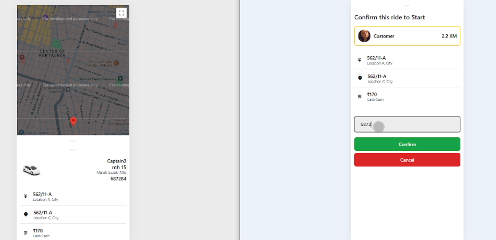
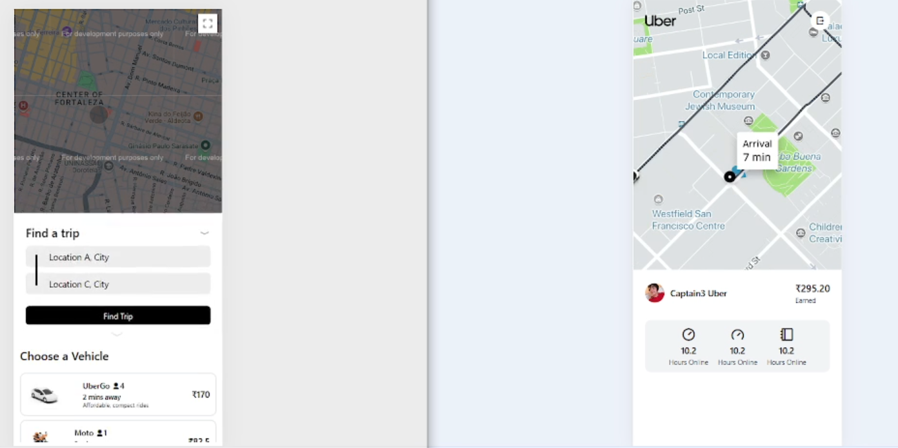

# MERN Stack Application

This repository contains a MERN stack application. The application is containerized using Docker and can be easily set up and run using Docker Compose.
## Video Demo

[/maxresdefault.jpg)](https://drive.google.com/file/d/1PeeknZp_YjWSgvqioOhuEHtfctvtezGG/view?usp=drive_link)



## Prerequisites

- Docker installed on your machine
- Docker Compose installed on your machine
- Node.js and npm installed on your machine (for running locally)



## Getting Started

Follow these instructions to get a copy of the project up and running on your local machine for development and testing purposes.

### Clone the Repository

```bash
git clone https://github.com/yourusername/your-repo-name.git
cd your-repo-name
```

### Running the Application with Docker

1. **Build and Start the Containers**

   Use Docker Compose to build and start the containers:

   ```bash
   docker-compose up --build
   ```

   This command will:
   - Build the Docker images for the backend and frontend services.
   - Start the backend, frontend, and MongoDB containers.
   - Set up the necessary network and volumes.

2. **Access the Application**

   - Frontend: Open your browser and navigate to `http://localhost:5173`
   - Backend: The backend server will be running on `http://localhost:3000`

### Running the Application Locally

1. **Set Up the Backend**

   ```bash
   cd backend
   npm install
   npm start
   ```

   The backend server will be running on `http://localhost:3000`.

2. **Set Up the Frontend**

   Open a new terminal window and navigate to the frontend directory:

   ```bash
   cd frontend
   npm install
   npm run dev
   ```

   The frontend application will be running on `http://localhost:5173`.

3. **Set Up MongoDB**

   Ensure you have MongoDB installed and running on your local machine. By default, it will run on `mongodb://localhost:27017`.

### Stopping the Application

To stop the running containers, use:

```bash
docker-compose down
```

This command will stop and remove the containers, networks, and volumes defined in the `docker-compose.yaml` file.

## Project Structure

```
.
├── backend
│   ├── Dockerfile
│   ├── package.json
│   └── ...other backend files
├── frontend
│   ├── Dockerfile
│   ├── package.json
│   └── ...other frontend files
├── docker-compose.yaml
└── README.md
```

## Built With

- [MongoDB](https://www.mongodb.com/) - NoSQL database
- [Express](https://expressjs.com/) - Web framework for Node.js
- [React](https://reactjs.org/) - JavaScript library for building user interfaces
- [Node.js](https://nodejs.org/) - JavaScript runtime

## Contributing

Please read [CONTRIBUTING.md](CONTRIBUTING.md) for details on our code of conduct and the process for submitting pull requests.

## License

This project is licensed under the MIT License - see the [LICENSE.md](LICENSE.md) file for details.

## Acknowledgments

- Hat tip to anyone whose code was used
- Inspiration
- etc
```
